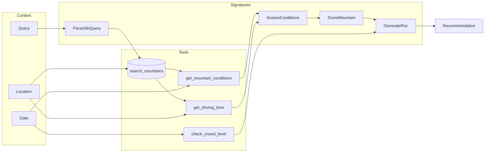
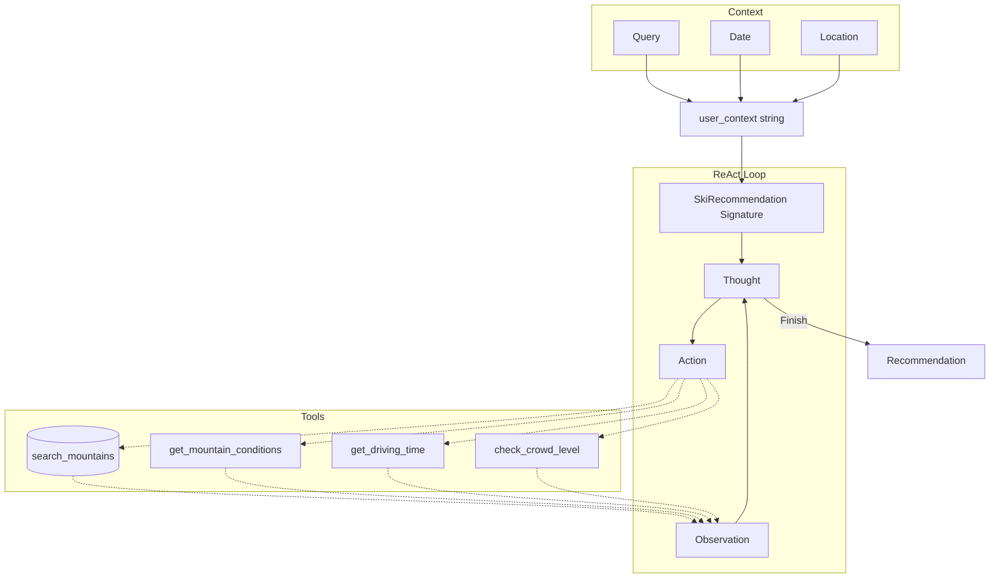

# Powder

An AI agent that answers: **"Where should I ski/snowboard today?"**

Given a natural language query, Powder recommends the best Northeast US mountain based on current conditions, your location, pass type, and preferences.

## Features

### Query Understanding

The agent parses natural language queries to extract:

| Filter Type | Examples |
|-------------|----------|
| **Pass type** | "I have an Ikon pass", "Epic pass holder" |
| **Drive time** | "within 2 hours", "max 3 hour drive" |
| **Terrain parks** | "looking for a good park", "rails and jumps" |
| **Glades/trees** | "tree skiing", "want to ski glades" |
| **Beginner terrain** | "teaching my kid", "first time skiing" |
| **Expert terrain** | "double blacks", "steep chutes" |
| **Night skiing** | "after work", "night skiing tonight" |
| **Skill level** | "intermediate snowboarder", "expert skier" |

### Mountains Covered

31 Northeast US mountains with full metadata:

- **Vermont** (9): Jay Peak, Killington, Mad River Glen, Mount Snow, Okemo, Smugglers' Notch, Stowe, Stratton, Sugarbush
- **New Hampshire** (9): Attitash, Bretton Woods, Cannon Mountain, Cranmore, Gunstock, Loon Mountain, Mount Sunapee, Waterville Valley, Wildcat Mountain
- **New York** (6): Belleayre Mountain, Gore Mountain, Holiday Valley, Hunter Mountain, Whiteface, Windham Mountain
- **Massachusetts** (4): Berkshire East, Jiminy Peak, Nashoba Valley, Wachusett Mountain
- **Maine** (3): Saddleback, Sugarloaf, Sunday River

Each mountain includes: coordinates, vertical drop, trail counts, terrain percentages, terrain parks, glades, pass types (Epic/Ikon/Indy), lift types, snowmaking %, learning facilities, pricing.

**Example Schema (Killington):**
```json
{
  "name": "Killington",
  "state": "VT",
  "lat": 43.6045,
  "lon": -72.8201,
  "vertical_drop": 3050,
  "num_trails": 155,
  "num_lifts": 22,
  "green_pct": 17,
  "blue_pct": 40,
  "black_pct": 33,
  "double_black_pct": 10,
  "terrain_parks": "easy,intermediate,hard,superpipe",
  "glades": "easy,intermediate,hard",
  "pass_types": "ikon",
  "allows_snowboarding": true,
  "lift_types": "gondola,bubble,highspeed,fixed",
  "has_night_skiing": true,
  "avg_weekday_price": 145,
  "avg_weekend_price": 190,
  "snowmaking_pct": 71,
  "has_magic_carpet": true,
  "has_ski_school": true,
  "learning_area_quality": "excellent"
}
```

### Data Sources

The agent combines three types of data:

#### Context (Provided at Query Time)
| Input | Description | Example |
|-------|-------------|---------|
| `query` | Natural language request | "Best powder with Ikon pass?" |
| `location` | User's starting point | Boston (lat: 42.36, lon: -71.06) |
| `date` | Target ski date | 2025-02-17 |

#### Database (Static Mountain Metadata)
Queried via `search_mountains()` tool - see schema above. Filters by:
- Pass type (Epic/Ikon/Indy)
- Terrain features (parks, glades, night skiing)
- Geographic bounds

#### Tools (Dynamic API Calls)
| Tool | Source | Returns |
|------|--------|---------|
| `get_conditions()` | Open-Meteo API | Fresh snow (24h), snow depth, temp, wind, visibility, weather code |
| `get_drive_time()` | OpenRouteService API | Duration (minutes), distance (miles) |
| `check_crowd_level()` | Date logic | Holiday/vacation week detection (Christmas, MLK, February break) |

## Architecture

Two agent implementations with tools available to both.

### Tools:

| Tool | Args | Returns | Notes |
|------|------|---------|-------|
| `search_mountains` | max_drive_hours, pass_type, needs_terrain_parks, needs_glades, needs_night_skiing, needs_beginner_terrain, needs_expert_terrain, user_lat, user_lon | JSON list of mountains | Uses Haversine prefilter. Agent must pass location explicitly. |
| `get_mountain_conditions` | lat, lon, target_date | JSON with temp, wind, snow depth, fresh snow, weather | Agent calls per-mountain (no batch). |
| `get_driving_time` | start_lat, start_lon, end_lat, end_lon | JSON with duration_minutes, distance | Agent must pass both origin and destination coords. |
| `check_crowd_level` | target_date, mountain_state | JSON with crowd_level, vacation_week, crowd_note | Holiday/vacation detection. |

### 1. Pipeline (Explicit Flow)

Fixed 4-step flow with embedded tool calls and intermediate outputs at each stage:



**DSPy Signatures (LLM calls):**

| Signature | Input | Output | Purpose |
|-----------|-------|--------|---------|
| **ParseSkiQuery** | Query + user_context | Structured filters | Extract pass type, max drive time, terrain preferences, skill level. User context provides date/location for resolving "today/tomorrow". |
| **AssessConditions** | Enriched candidates | Day quality assessment | Compare conditions *across all mountains* to determine if it's a powder day, icy day, or skip day. Provides context for scoring. |
| **ScoreMountain** | Each candidate + assessment | Score (0-100) + pros/cons | Score each mountain considering conditions, terrain match, drive time. Uses day assessment to calibrate (e.g., lower bar on icy days). |
| **GenerateRec** | Scores + crowd context | Final recommendation | Produce natural language recommendation with top pick, alternatives, and caveats. |

**Why AssessConditions matters:** Without comparing across mountains, the agent can't distinguish "great day at Mountain X" from "Mountain X is the best of bad options". It enables responses like "Skip today, conditions are poor everywhere" or "Any of these would be great - pick based on drive time."

### 2. ReAct (Flexible Agent)

Autonomous loop - agent decides which tools to call and when to stop (max 8 iterations):




**Key differences from Pipeline:**
- **No ParseSkiQuery** - agent interprets query directly in its reasoning
- **No AssessConditions/ScoreMountain** - agent does comparative reasoning implicitly in Thought steps
- **Flexible order** - agent chooses which tools to call and may skip some or call multiple times
- **Single signature** - just `SkiRecommendation(query, user_context) → recommendation`

### Execution Traces

Save detailed execution traces with `--save-trace` for debugging and comparison:

```bash
# Compare both agents on the same query
python -m powder --date 2025-03-29 --save-trace --pipeline "Worth skiing today?"
python -m powder --date 2025-03-29 --save-trace "Worth skiing today?"
```

**Example traces:** [Pipeline](traces/pipeline_2025-01-08_20260107_172606.json) | [ReAct](traces/react_2025-01-08_20260107_172133.json)

| Trace Contents | Pipeline | ReAct |
|----------------|----------|-------|
| `meta` | query, agent, date, location, model, timestamp | same |
| `result.parsed` | Structured filters from ParseSkiQuery | - |
| `result.candidates` | 7 mountains with conditions + drive times | - |
| `result.day_assessment` | Day quality, best available, context | - |
| `result.scores` | 7 scored mountains with pros/cons | - |
| `result.recommendation` | - | Final text output |
| `lm_history` | 10 LLM calls (Parse + Assess + 7×Score + Generate) | 4 LLM calls showing Thought→Action→Observation loop |

The ReAct trace shows the agent's reasoning process (skip day detection):
```
Call 1: "The user is asking if it's worth skiing today... Let me start by searching for nearby mountains"
Call 2: "Nashoba Valley has essentially no snow (0 inches)... Let me check Wachusett Mountain"
Call 3: "Wachusett Mountain also has no snow... Both mountains have essentially no base"
Final:  "Not Recommended for Today - insufficient snow coverage"
```

## Setup

```bash
make          # Create venv and install dependencies
make seed-db  # Populate the mountain database
make test     # Run tests (fast, no API calls)
```

Requires [uv](https://github.com/astral-sh/uv) for package management.

### Adding More Mountains and Historic Weather Coverage

Use the seed script to add mountains from the predefined list via Claude slash comand [`add_mountain.md`](.claude/commands/add_mountain.md). Update the hardcoded list in the script if you want to expand to other regions, etc.

```bash
# List mountains not yet in the database
python scripts/seed_missing_mountains.py

# Add N mountains using Claude to research and populate data
python scripts/seed_missing_mountains.py --run --num 10

# After adding mountains, re-fetch historic weather data
make fetch-historic
```

Add API keys to `.env`:

```bash
ANTHROPIC_API_KEY=your_key_here
OPEN_ROUTE_SERVICE_API_KEY=your_key_here  # Get free key at https://openrouteservice.org
```

## Usage

```bash
# Run with a query (uses ReAct agent by default)
python -m powder "Where should I ski tomorrow? I have an Ikon pass."

# Use Pipeline instead of ReAct
python -m powder --pipeline "Best powder within 3 hours?"

# Run on historic data (uses fixtures instead of live weather API)
python -m powder --date 2025-02-17 "Best powder day with Ikon pass?"

# Different starting location
python -m powder --location nyc "Epic pass, best terrain?"

# Interactive mode
python -m powder
```

### Historic Sanity Checks

Test the agent on known good/bad days from the 2024-2025 season:

**Powder Days (clear winners):**
| Date | Scenario | Expected | Command |
|------|----------|----------|---------|
| 2025-02-17 | Big dump | Sugarloaf (5.7") | `python -m powder --date 2025-02-17 "Best powder with Ikon?"` |
| 2025-03-29 | Late season storm | Stowe (5.5") | `python -m powder --date 2025-03-29 "Epic pass powder?"` |

**Skip Days (bad conditions):**
| Date | Scenario | Conditions | Command |
|------|----------|------------|---------|
| 2025-01-08 | Brutal cold | -8°F, 0.4" avg | `python -m powder --date 2025-01-08 "Worth skiing today?"` |
| 2024-12-22 | Pre-Xmas ice | -7°F, no fresh | `python -m powder --date 2024-12-22 "Ikon pass today?"` |
| 2025-03-31 | Spring slush | 54°F avg, 69°F max | `python -m powder --date 2025-03-31 "Should I ski today?"` |

**Beautiful Days (multiple good options):**
| Date | Scenario | Conditions | Command |
|------|----------|------------|---------|
| 2025-01-29 | Warm refresh | 1-2" everywhere, 25°F | `python -m powder --date 2025-01-29 "Best skiing today?"` |
| 2025-02-03 | Tie-breaker | 1" avg, pleasant | `python -m powder --date 2025-02-03 "Where should I go?"` |

These dates have known conditions - useful for validating agent behavior on different scenarios.

## Evaluation

The evaluation framework measures agent performance with **deterministic metrics** (no LLM-as-judge).

### Current Results (GEPA-Optimized)

| Metric | Pipeline | ReAct |
|--------|----------|-------|
| **Hit@1** | **93.8%** | 87.5% |
| **Hit@3** | **93.8%** | 87.5% |
| **Constraint Satisfaction** | 100.0% | n/a* |

*ReAct constraint metric is n/a because it returns unstructured text.

Pipeline improved from 41.7% → 93.8% Hit@1 through Pydantic fixes and GEPA optimization.

### Metrics

| Metric | Description |
|--------|-------------|
| **Hit@1** | Top recommendation matches expected mountain |
| **Hit@3** | Expected mountain appears in top 3 |
| **Constraint Satisfaction** | Respects pass type, drive time, terrain requirements |
| **Parse Accuracy** | Correctly extracts filters from natural language |

### Dataset

47 labeled examples across 4 signatures + 16 end-to-end:

- `ParseSkiQuery` - 12 examples (97.4% accuracy)
- `AssessConditions` - 4 examples (83.3%)
- `ScoreMountain` - 8 examples (93.8%)
- `GenerateRecommendation` - 7 examples (100% accuracy)
- End-to-end - 16 examples with historic weather data

### Running Evals

```bash
make eval           # Run full evaluation suite
make eval-verbose   # Show detailed output for failures

# Run specific mode
python -m powder.evals.runner --mode react
python -m powder.evals.runner --mode pipeline
python -m powder.evals.runner --mode both
```

### GEPA Optimization

Optimize signatures with GEPA (Reflective Prompt Evolution):

```bash
# Optimize individual signatures
python -m powder.evals.optimize --signature score_mountain --max-calls 50
python -m powder.evals.optimize --signature assess_conditions --max-calls 50

# Optimize ReAct with tool descriptions
python -m powder.evals.optimize --signature react --max-calls 30
```

Optimized prompts are saved to `powder/optimized/` and automatically loaded by the pipeline.

### Historic Weather Data (Backtesting)

Fetch real weather data from the 2024-2025 ski season for reproducible backtesting:

```bash
# Fetch full season (Dec 1 - Apr 15, all mountains × 136 days)
make fetch-historic

# Fetch specific date range
.venv/bin/python -m powder.evals.fetch_historic --start 2025-01-01 --end 2025-01-31

# View summary of fetched data (best powder days, coldest days, etc.)
make backtest-summary
```

This creates fixtures in `powder/evals/fixtures/` that can be used for:
- Creating eval examples from real historic conditions
- Reproducible backtesting without API calls
- Analyzing which days the agent would have recommended correctly

## Testing

```bash
make test       # Fast tests (no API calls)
make test-llm   # LLM tests (requires ANTHROPIC_API_KEY)
make test-all   # All tests
make test-cov   # With coverage report
```

## Project Structure

```
powder/
├── __main__.py         # CLI entry point (python -m powder)
├── pipeline.py         # Explicit multi-step pipeline
├── agent.py            # ReAct-based agent
├── signatures.py       # DSPy signatures
├── tools/
│   ├── database.py     # Mountain DB queries
│   ├── weather.py      # Open-Meteo client
│   ├── routing.py      # Drive time calculations
│   └── crowds.py       # Holiday/vacation detection
├── data/
│   ├── mountains.jsonl # Mountain metadata
│   └── mountains.db    # SQLite database
├── optimized/          # GEPA-optimized prompts (auto-loaded)
│   ├── parse_query.json
│   ├── score_mountain.json
│   ├── assess_conditions.json
│   └── react_agent.json
└── evals/
    ├── runner.py       # Evaluation runner
    ├── optimize.py     # GEPA optimization script
    ├── backtest.py     # Historic data backtesting
    ├── find_interesting_days.py
    └── fixtures/       # Historic weather data (136 days)
```

## Stack

- **DSPy** - Agent framework with signatures and optimizers
- **Open-Meteo** - Weather/snow data (free, no API key)
- **OpenRouteService** - Drive time calculations (free tier)
- **SQLite + SQLAlchemy** - Mountain database

## Future Improvements

### Data Sources

| Enhancement | Description | Difficulty |
|-------------|-------------|------------|
| **Liftie API** | Real-time lift status (open/closed/hold) | Easy |
| **Trail grooming reports** | Which trails were groomed overnight | Medium |
| **Webcam integration** | Visual conditions verification | Medium |
| **Snow report scraping** | Official resort-reported conditions | Medium |

### Snow Quality Inference

Currently we use raw weather data. Could infer surface conditions from patterns:

| Weather Pattern | Inferred Quality |
|-----------------|------------------|
| Fresh snow + stayed cold | Powder |
| Rain → overnight freeze | Icy/crusty |
| Warm afternoon (>35°F) | Slushy/spring |
| Cold + wind + no new snow | Hardpack/wind-affected |
| Prolonged cold, no precip | Machine groomed, firm |

### Smarter Crowd Prediction

Current: Holiday/vacation week detection only.

Future possibilities:
- Historical lift line wait times
- Parking lot camera analysis
- Real-time traffic data on access roads
- Weather-based demand modeling (powder days = crowds)

### User Personalization

- Save user preferences (home location, pass type, skill level)
- Learn from feedback on recommendations
- "I went to X and it was great/terrible" → adjust scoring

### Regional Expansion

Currently: Northeast US (31 mountains)

Could expand to:
- Colorado Front Range / Summit County
- Utah (Park City, Salt Lake resorts)
- Lake Tahoe
- Pacific Northwest

### Agent Improvements

| Feature | Description |
|---------|-------------|
| **Multi-day planning** | "Best 3-day ski trip next week" |
| **Group optimization** | Balance different skill levels in party |
| **Budget awareness** | Factor in lift ticket prices, gas costs |
| **Alternative activities** | "If skiing is bad, what else nearby?" |
