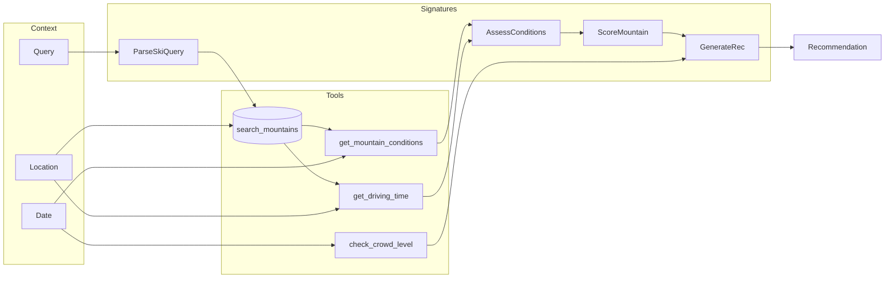

# Powder — Live Demo

## Setup

```bash
cd ~/ml/powder
git checkout main
source .venv/bin/activate
```

---

## The Pipeline

This system has 4 LLM calls, each with its own optimizable prompt (DSPy Signature):

1. **Parse** — extract structured filters from natural language
2. **Assess** — look at all mountains' weather and decide: is today worth skiing?
3. **Score** — rate each mountain individually given the day context
4. **Recommend** — synthesize everything into a final pick

Each signature can be independently optimized with GEPA (Genetic Evolution of Prompts).



---

## Step 1 — Live Query

Run the pipeline against today's real weather data:

```bash
python -m powder --pipeline "Wheres the best place to go for powder with Ikon pass?"
```

The output walks through each pipeline stage:

- **PARSED QUERY** — The LLM extracted `ikon` pass and `powder_chase` vibe from plain English. No regex, no hand-coded parser.
- **DAY ASSESSMENT** — The system looked at every mountain's conditions and made a judgment call. This shared context cascades through everything downstream.
- **MOUNTAIN SCORES** — Each mountain scored individually. Fresh snow, temperature, and drive time are all visible. The ranking should reflect reality.
- **RECOMMENDATION** — Final pick with alternatives and caveats. If it's a bad day, the system says so.

---

## Step 2 — The Hard Test (Skip Day)

January 8th, 2025 was brutally cold with almost no fresh snow. This is the hardest
thing to get right — LLMs naturally want to be helpful and recommend *something*.

```bash
python -m powder --date 2025-01-08 --pipeline "Worth skiing today?"
```

The system says "don't go." Day quality is `poor`, all scores are below 55.
AssessConditions creates shared context that cascades through the whole pipeline —
when it says "poor day," every downstream score respects that.

Teaching an LLM to say "skip today" required GEPA optimization.

---

## Step 3 — Before Optimization

Now the same queries, but with the original hand-written prompts.
Same code, same model, same data — only the prompt instructions change.

```bash
git checkout pre-gepa
```

```bash
python -m powder --date 2025-02-17 --pipeline "Best powder with Ikon pass?"
```

Scores are off. The system is too generous with mediocre mountains.
Rankings may not match the actual conditions.

```bash
python -m powder --date 2025-01-08 --pipeline "Worth skiing today?"
```

Does it still tell you to stay home, or does it try to recommend something anyway?

---

## Step 4 — The Diff

What exactly did the optimizer discover and add to the prompts?

```bash
git diff pre-gepa main -- anyscale_presentation/prompts/assess_conditions.md
```

Everything in green was written by GEPA, not a human.
It found a parsing bug (`"stay_home"` is not a valid output),
temperature edge cases (`38-40°F with zero fresh snow = poor`),
and ranking logic that a human might take weeks to discover through user complaints.

```bash
git diff pre-gepa main -- anyscale_presentation/prompts/score_mountain.md
```

The scoring prompt went from 19 lines to 71 lines.
GEPA added input/output specs, contextual boosts, a 6-step decision
framework, and tone guidance — all from analyzing failures in labeled examples.

---

## Step 5 — Eval Suite

```bash
git checkout main
```

```bash
python -m powder.evals.runner
```

Deterministic metrics, no LLM-as-judge. 47 labeled examples across 4 signatures
plus 16 end-to-end tests. Pipeline went from 41.7% to 93.8% Hit@1 through optimization.

This is what makes it a testable, measurable system instead of prompt vibes.
You can run this in CI. When you swap models, you re-optimize and re-eval.

---

## Key Takeaways

- Same model, same code, same data — the only difference is the prompt instructions
- Prompts are the weights of your LLM program — optimize them systematically
- GEPA found edge cases in 5 iterations for ~$15 that a human might take weeks to discover
- The eval suite gives you CI/CD for prompt quality — no more "we changed the prompt and hope it still works"
