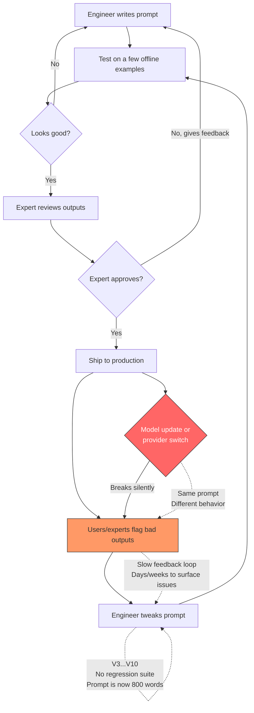

# DSPy Presentation Outline — Anyscale Panel Round

**Format:** 20-min mock presentation + 5-10 min live demo to "Anycompany" stakeholders (developers, architects, C-level)

**Key guidance from Pawarit:** Panel attendees may not know DSPy. Dumb down diagrams/bullet points. Best demos show live code, not just slides/UI.

**Key guidance from Rich Adao (recruiter):**
- **Couple slides only** — keep slides minimal, most time in demo/discussion
- **Explain like they're non-technical** — assume mixed audience (AEs will be there, very coveted with account executives)
- **Pause after each point for questions** — this is NOT a one-way presentation, they want engagement and dialogue
- **Agenda slide up front** — frame what you'll cover, build to next steps at the end
- **Agentic angle** — agentic is a door they're looking to open to get new customers, lean into this

---

## Slide Outline (~5-7 slides + demo, 20 min total)

### Slide 1: Title + Agenda

**"DSPy: Programmatic LLM Optimization"**

- Your name, date, "presented to Anycompany"
- One-liner: "What if you could optimize prompts like you optimize model weights?"

**Agenda frame** *(Rich's advice: set expectations up front)*:
1. The problem — why prompt engineering breaks down
2. DSPy — a programmatic alternative
3. Live demo — a real app optimized with DSPy
4. What this means for Anycompany's LLM stack
5. Next steps & discussion

> "I'll keep slides light and spend most of our time in live code. Please jump in with questions at any point — I'd rather this be a conversation than a lecture."

---

### Slide 2: The Problem — The Production Prompt Loop (3 min)

**"Prompt Engineering Doesn't Scale"**

Tell this as a timeline most teams live through:

1. **V1: Engineer writes prompt** — reads API docs, tries a few examples, ships something that "works on my inputs"
2. **V2: Experts review outputs** — domain experts flag bad outputs. "Why did it recommend Nashoba over Killington?" Engineer reads the complaint, adds a sentence to the prompt.
3. **V3-V10: Whack-a-mole** — every fix creates new regressions nobody catches until an expert flags them weeks later. No regression suite. The prompt is now 800 words of accumulated patches.
4. **Model update day** — provider upgrades `gpt-4-turbo` to a new checkpoint, or you switch from OpenAI to Claude. Half your carefully tuned phrasing stops working. You discover this in production, not in testing.
5. **API format change** — chat vs completions, tool-use schemas change, structured output formats differ. Your prompt template breaks at the integration layer, not just the content layer.
6. **The knowledge walks out the door** — the engineer who tuned the prompt leaves. Nobody knows *why* line 47 says "38-40°F with zero fresh snow = poor". There's no audit trail.



**What goes wrong at scale:**
- No eval to catch regressions — you find out from user complaints
- Expert feedback loop is slow (days/weeks) and lossy (expert says "this is wrong" but can't articulate the fix)
- Model changes silently shift behavior — same prompt, different model, different failure modes
- 10 features × 3 model providers × quarterly model updates = 30+ manual tuning loops per year

> How many of you prompt ChatGPT or Claude differently today than you did a year ago? You adapted naturally — but your production prompts don't. They're frozen in time while the rest of the system continually improves.

---

### Slide 3: What DSPy Is (3 min)

**"Declare What, Not How"**

- Analogy: **Prompt engineering is like writing driving directions by hand.** "Take the second left after the gas station." It works — until the gas station closes, or there's construction, or your friend takes a detour to grab coffee and starts from a different street. DSPy is GPS. You define where you want to go — the ins and outs — and it figures out the route for whatever model you're running right now.

- Three concepts, one sentence each *(keep it non-technical for AEs in the room)*:
  - **Signature** = "I need text in, label out" — you define the ins and outs, not the prompt
  - **Module** = chain signatures together like Lego blocks
  - **Optimizer** = automatically finds the best prompts for your task and model
- Simple diagram: `Signature → Module → Optimizer → Better Prompts`
- Optional: show 4-line code example if audience is technical; skip if not

```python
class Classify(dspy.Signature):
    text: str = dspy.InputField()
    label: str = dspy.OutputField()

classify = dspy.Predict(Classify)
result = classify(text="I love this product")
```

> *(Pause here)* "Any questions on the core concepts before I show how the optimizer works?"

---

### Slide 4: How Optimization Works (3 min)

**"GEPA: Genetic Evolution of Prompts"**

Dumbed-down explanation for non-DSPy panel members:

1. You provide labeled examples (input → expected output)
2. GEPA generates candidate prompt instructions
3. Evaluates each candidate against your examples
4. Keeps winners, mutates/crosses over → next generation

Diagram: simple evolutionary loop (candidates → eval → select → mutate → repeat)

Key insight: "The optimizer discovers edge cases you'd never think to write instructions for"

**Show the actual evolution tree** *(use AssessConditions as the example)*:

```
Gen 0: Original docstring (41.7% Hit@1)
  ├─ Candidate A: + output constraints ("stay_home" is NOT valid) → 58%
  ├─ Candidate B: + temperature edge cases (38-40°F = poor) → 52%
  └─ Candidate C: minor rewording → 43%
Gen 1: A wins → mutate + crossover with B
  ├─ A+B: output constraints + temp rules → 71%
  ├─ A+ranking logic → 65%
  └─ ...
Gen 2: A+B wins → add more mutations
  └─ + context narrative checklist → 82%
Gen 3: Final convergence
  └─ + ranking logic + preference weighting → 93.8%
```

*(Note: actual tree will be captured by re-running GEPA with logging — see Demo Prep below)*

> **Audience question:** "If you had to optimize a prompt today — say for a classification task — what would your process look like? How would you know when you're done?" *(Opens the door to show that most teams don't have a rigorous answer, which is exactly what DSPy solves)*

---

### Slide 6: The Demo App — Powder (1 min)

**"Where Should I Ski Today?"**

- Problem: 31 mountains, variable weather, personal preferences → too many variables for a human to track
- Input: natural language query + date + location
- Output: ranked recommendation with scores, pros/cons, skip-day detection
- Quick architecture diagram (simplified pipeline flow)

---

### Slide 7: Pipeline Architecture (2 min)

**4 Signatures, Each Independently Optimizable**

```
ParseSkiQuery → AssessConditions → ScoreMountain → GenerateRec
```

- Key design decision: **AssessConditions** creates shared context across all mountains — enables "skip day" detection
- Point out: this is like a multi-step ML pipeline where each stage has its own "model"
- Compared to ReAct (single signature, agent decides what to do) — Pipeline is more controllable and optimizable

---

### Slide 7: What GEPA Learned — The Diff (2 min)

**"Before/After Optimization"**

Show the actual diff of `AssessConditions` (the best example — short original, dramatic additions):

**Before** (human-written docstring):
```
Day quality calibration:
- stay_home: Dangerous cold (<0°F), rain, ice storms...
- poor: Brutal cold (0-10°F) with <2" fresh snow...
```

**After** (GEPA-optimized — additions highlighted):
```diff
+ CRITICAL CONSTRAINTS on day_quality output:
+ - "stay_home" is NOT a valid day_quality value
+ - If conditions are truly bad, use 'poor' instead
+
+ Temperature interpretation:
+ - 38-40°F with zero fresh snow = poor
+ - Warm temps (>40°F) with no fresh snow is especially bad
+
+ Ranking logic:
+ - Fresh snow depth is the primary differentiator
+ - For powder-focused users, heavily weight fresh snow and wind
```

| Failure Mode | GEPA's Fix |
|--------------|------------|
| Invalid "stay_home" output broke parsing | Added: `"stay_home" is NOT a valid day_quality value` |
| 38-40°F misclassified as "fair" | Added: `38-40°F with zero fresh snow = poor` |
| Nashoba (240ft vertical) recommended over Killington | Added: `small mountains like 240 ft vertical limit exploration` |
| LLM too positive about mediocre days | Added: `A 65-score day is not "good" even if it has some positive aspects` |

These are things a human prompt engineer *might* eventually find, but GEPA found them systematically from failures.

> **Audience question:** "Looking at that table — which of those failure modes would you have caught first if you were hand-tuning? The parsing bug? The temperature edge case? The small mountain bias?" *(Makes the audience internalize that systematic optimization catches things humans miss or catch late, and gets them engaged with the specific examples)*

---

### Slide 9: Results (1 min)

**41.7% → 93.8% Hit@1**

| Metric | Pipeline | ReAct |
|--------|----------|-------|
| **Hit@1** | **93.8%** | 87.5% |
| **Hit@3** | **93.8%** | 87.5% |
| **Constraint Satisfaction** | **100%** | n/a* |

- All deterministic metrics — no LLM-as-judge
- 47 labeled examples across 4 signatures + 16 end-to-end
- Pipeline improved from 41.7% → 93.8% through GEPA optimization

---

### Slide 10: Why Anycompany Should Care (2 min)

**"What This Means for Your LLM Stack"**

- **Model portability**: re-optimize when switching providers (GPT-4 → Claude → Llama) — no manual prompt rewrite
- **Quality at scale**: systematic optimization > human intuition, especially across 10+ features
- **Developer velocity**: engineers write Python, not prompts
- **Cost reduction**: optimized prompts can be shorter and use fewer tokens
- **Testability**: eval framework gives you CI/CD for prompt quality
- **Agentic workflows** *(Rich flagged this as a key growth area for Anyscale)*: DSPy modules compose naturally into multi-step agents — each step independently optimizable, testable, and measurable

---

### Slide 11: Next Steps + Discussion

**"Where Do We Go From Here?"** *(Rich's advice: always build to next steps)*

- Suggested next steps for Anycompany:
  1. Identify 1-2 existing LLM features with known quality issues
  2. Define eval metrics (what does "good" look like?)
  3. Run DSPy optimization — measure before/after
  4. Scale the pattern across features
- "Happy to help scope a pilot or walk through your specific use cases"

> Open floor: "What LLM challenges are you running into today? Where does prompt quality bite you?"

---

## Live Demo Plan (~8-10 min)

### Demo 1 — Before Optimization: Show the Problem (3 min)

Start on the `pre-gepa` branch to show what unoptimized prompts produce:

```bash
git checkout pre-gepa
python -m powder --date 2025-02-17 --pipeline "Best powder with Ikon pass?"
```

- Walk through the output — point out specific failures:
  - Wrong mountain ranked #1 (e.g., Nashoba over Killington)
  - "stay_home" output that breaks parsing
  - Scores that are too generous (70+ for mediocre days)
- "This is what you get with a hand-written prompt. It *kind of* works, but the edge cases are brutal."

### Demo 2 — After Optimization: Same Query, Better Results (2 min)

Switch to `main` (GEPA-optimized) and run the same query:

```bash
git checkout main
python -m powder --date 2025-02-17 --pipeline "Best powder with Ikon pass?"
```

- Same query, same data, dramatically different output
- Point out: correct mountain wins, scores are calibrated, tradeoffs are honest
- "The only thing that changed is the prompt instructions — same code, same model, same data"

### Demo 3 — Show the Diff (2 min)

```bash
git diff pre-gepa main -- powder/optimized/assess_conditions.json
```

- Show the actual diff — audience sees exactly what GEPA added
- Highlight the 3 key additions: output constraints, temperature interpretation, ranking logic
- "A human might eventually find these — GEPA found them in 5 iterations for $15"

### Demo 4 — Skip Day (2 min)

```bash
python -m powder --date 2025-01-08 --pipeline "Worth skiing today?"
```

- Show: agent says "don't go" — -8°F, 0.4" avg snow
- This is the hardest thing to get right — LLMs want to be helpful and recommend *something*
- Highlight: AssessConditions produces `day_quality: "poor"` which cascades to low scores

> **Audience question:** "So that was a powder day — clear winner. But what do you think an LLM does when *every* mountain has terrible conditions? Should it still recommend something?" *(Sets up the skip-day demo and highlights the hardest part of the problem)*

### Demo 5 (Stretch) — Run GEPA Live (3 min)

If time allows, run GEPA optimization on a single signature with 2-3 generations:

```bash
# TBD: command to run GEPA on assess_conditions with logging
```

- Audience watches candidates get generated, evaluated, scored in real-time
- Even 2 minutes of this tells the story viscerally — "this is what replaces the manual tuning loop"
- Show the evolution tree output: which candidates won, which were discarded, why

### Demo 6 (Optional) — Run Evals

```bash
make eval
```

- Show the eval harness running, metrics printing
- Reinforces: this is a testable, measurable system — not prompt vibes

---

## Presentation Tips

### Rich's Core Advice (recruiter coaching)

- **Minimal slides, maximum engagement** — couple slides, not a deck. Most time in demo + conversation
- **Explain to non-technical people** — AEs will be there, they're coveted with account executives
- **Pause after each point** — ask if there are questions before moving on. It's a dialogue, not a monologue
- **Agenda → content → next steps** — frame up front what you'll cover, close with clear next steps
- **Agentic angle matters** — this is a door they're trying to open for new customers

### Anchoring for Non-DSPy Audience

- The **PyTorch analogy** (Slide 3) is your anchor — keep coming back to it
- "Signatures are like layer definitions, optimizers are like backprop for prompts"
- When showing code, narrate what it does rather than expecting people to read it
- For AEs: focus on business value (cost, quality, speed) not implementation details

### Storytelling Arc

1. **Problem** → prompts don't scale (everyone feels this)
2. **Solution** → DSPy makes it programmatic
3. **Proof** → live demo with real data, measurable results
4. **Value** → why Anycompany should adopt this pattern
5. **Next steps** → concrete pilot proposal

### Tying Back to Anyscale (if asked)

- GEPA's eval loop (parallel candidate evaluation) maps to Ray perfectly
- Each generation's candidates can be evaluated in parallel via `ray.data.map_batches`
- The expensive part (LLM evals per candidate) is embarrassingly parallel
- Generation loop itself is sequential (like RL policy updates — Ray's oldest use case)
- **Agentic on Ray**: each agent step as a Ray Serve actor, tool calls as Ray tasks — DSPy optimizes each step, Ray scales the execution
- **Data-driven workloads**: DSPy optimization is inherently data-driven (labeled examples → metrics → optimization) — fits Anyscale's consumption model

### Time Management

- Slides: ~8 min (Rich said couple slides — keep it tight)
- Demo: ~8 min
- Discussion/Q&A: ~4 min (built into pauses throughout)
- If running short on time, skip Demo 4 (evals)
- If running long, abbreviate Slide 5 (GEPA details) — the demo results speak louder

---

## Key Files for Demo Prep

| Purpose | File |
|---------|------|
| Run the agent | `python -m powder [query] --date [date] --pipeline` |
| DSPy signatures | `powder/signatures.py` |
| Pipeline flow | `powder/pipeline.py` |
| GEPA-optimized prompts | `powder/optimized/*.json` |
| Eval runner | `powder/evals/runner.py` |
| Eval examples | `powder/evals/end_to_end.py` |
| Results summary | `evaluation/evaluation_results.md` |
| GEPA before/after | `docs/gepa_pipeline_comparison.md` |

---

## Demo Prep — Branch Setup & GEPA Evolution Capture

### 1. Create `pre-gepa` branch

- Branch from `main`
- Reset `powder/optimized/*.json` to use original signature docstrings (from `signatures.py`) as instructions
- This gives a live toggle: `git checkout pre-gepa` → bad results, `git checkout main` → good results

### 2. Capture GEPA evolution tree

- Re-run GEPA on `AssessConditions` only (cheapest, most dramatic improvement)
- Instrument to log each generation: candidates, mutations, scores
- Save artifacts: `anyscale_presentation/gepa_evolution/gen_0.txt`, `gen_1.txt`, etc.
- Build the tree visual for Slide 4 from real data

### 3. Verify branch-switching demo

- Test that `pre-gepa` produces visibly wrong output on the same queries used in demos
- Test that `main` produces correct output
- Practice the `git checkout` flow so it's smooth in the live demo

### 4. (Stretch) GEPA live-run command

- Create a lightweight script that runs GEPA on one signature with verbose logging
- Target: 2-3 generations, ~2 min runtime, visible candidate evaluation output

---

## GEPA Experience Notes (for Q&A)

- Super easy to implement with DSPy — just plug in optimizer
- Only as good as your examples — leaky/incorrect labels → wonky optimized prompts
- Spent ~$15 over ~5 iterations, threw a few out after fixing bugs in examples
- Focused strictly on Hit@1 and Hit@3 as the optimization target
- The optimized prompts are surprisingly readable — you can see exactly what it learned
- Pattern: "judgment" signatures (Assess, Score) got heavy optimization; "structural" signatures (Parse, Generate) stayed mostly the same

