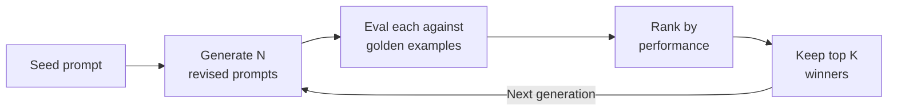
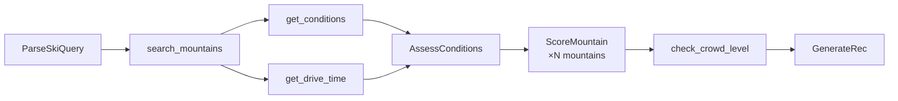

# DSPy Presentation Outline — Anyscale Panel Round

**Format:** 20-min mock presentation + 5-10 min live demo to "Anycompany" stakeholders (developers, architects, C-level)

**Key guidance from Pawarit:** Panel attendees may not know DSPy. Dumb down diagrams/bullet points. Best demos show live code, not just slides/UI.

**Key guidance from Rich Adao (recruiter):**
- **Couple slides only** — keep slides minimal, most time in demo/discussion
- **Explain like they're non-technical** — assume mixed audience (AEs will be there, very coveted with account executives)
- **Pause after each point for questions** — this is NOT a one-way presentation, they want engagement and dialogue
- **Agenda slide up front** — frame what you'll cover, build to next steps at the end
- **Agentic angle** — agentic is a door they're looking to open to get new customers, lean into this

**Narrative frame:** Tell it as a customer story. A team built an LLM app, it had quality problems, they fixed it with DSPy. The audience should see themselves in the story — not watch someone show off a side project.

---

## Slide Outline (6 slides + demo in the middle, 20 min total)

### Slide 1: Title + Agenda (30s)

**"DSPy: Programmatic LLM Optimization"**

- Your name, date, "presented to Anycompany"
- One-liner: "What if you could optimize prompts the same way you optimize model weights?"

**Agenda frame** *(Rich's advice: set expectations up front)*:
1. The problem — an app with LLM quality issues
2. Why hand-tuning prompts couldn't fix it
3. DSPy — a programmatic alternative
4. Live demo — before and after optimization
5. What this means for your LLM stack

> "I'll keep slides light and spend most of our time in live code. Please jump in with questions at any point — I'd rather this be a conversation than a lecture."

---

### Slide 2: The App + The Problem (2.5 min)

**"We Built an App. It Worked... Mostly."**

Introduce the app as a customer scenario:

> "Let's say you've built an app that recommends ski mountains. A user asks 'best powder day with my Ikon pass?' and the system checks real weather for 31 mountains, filters by pass type, scores each one, and gives a ranked recommendation. Four LLM calls, each with a hand-written prompt. You ship it. It works... mostly."

Then walk through what went wrong — use real failures from the app:

1. **Users start complaining** — the system recommends Nashoba Valley (240 feet of vertical, basically a bunny hill) over Killington on a powder day. Why? The prompt didn't say "bigger mountains are better for powder."
2. **Engineer patches the prompt** — adds a line about vertical drop. Now a different edge case breaks: 38°F with no fresh snow gets rated "fair" instead of "poor."
3. **Whack-a-mole** — every fix creates new regressions nobody catches until the next complaint. The prompt is now 800 words of accumulated patches. No regression suite.
4. **Model update** — you switch from GPT-4 to Claude. Half the carefully tuned phrasing stops working. You discover this in production.
5. **The engineer leaves** — nobody knows *why* line 47 says "38-40°F with zero fresh snow = poor." There's no audit trail.

> "Sound familiar? This is what every team with production LLM features lives through."

**Why this doesn't scale:**
- No eval to catch regressions — you find out from user complaints
- Expert feedback is slow (days/weeks) and lossy
- Model changes silently shift behavior — same prompt, different results
- 10 features × 3 providers × quarterly updates = 30+ manual tuning loops per year

---

### Slide 3: DSPy — The Framework (2 min)

**"What If You Didn't Have to Write the Prompts?"**

Other frameworks (LangChain, LlamaIndex) let you chain LLM calls together and plug in tools — but you still hand-write every prompt and manually tune it. That's the loop from Slide 2. DSPy keeps the composability but replaces the hand-written prompts with something you can optimize programmatically.

- Three building blocks:
  - **Signature** = declare your inputs and outputs. "I need weather data in, day quality rating out." You define the *shape* — DSPy generates the actual prompt. This is what other frameworks make you write by hand.
  - **Tool** = a regular function the LLM can call. Database lookups, weather APIs, routing. You build these once and they're reusable across different architectures.
  - **Module** = how you wire signatures and tools together. You can build a deterministic pipeline or a ReAct agent from the same parts.

- **Optimizer** = give it labeled examples, it finds better prompts for your signatures. This is what no other framework does — it closes the feedback loop automatically.

**The shift:** This turns prompt engineering from vibes into a measurable practice. You're not guessing if your prompt is good — you're measuring it against labeled examples and optimizing for a score. But that means **your examples are everything**. Bad labels → bad prompts. Incomplete examples → blind spots.

> *(Pause)* "Questions on the framework before I show how the optimizer works?"

---

### Slide 4: GEPA — How Optimization Works (2 min)

**"How Do You Actually Optimize the Prompts?"**

DSPy supports multiple optimizers. For this app, **GEPA** (Genetic Evolution of Prompts and Assertions) worked best because the prompts needed better *instructions*, not just more examples.

GEPA in 6 steps:

1. Start with a basic "seed" prompt and labeled examples with golden answers
2. Generate a bunch of revised prompts from the seed
3. Evaluate each revision against the golden examples
4. Rank by performance
5. Keep the top winners as seeds for the next generation
6. Repeat



Key insight: "The optimizer discovers edge cases you'd never think to write instructions for."

> "Let me show you what that looks like on the ski app. Remember that prompt that kept breaking? Let's see what happens when we let the optimizer fix it instead of an engineer."

---

### Demo Part 1: Single Signature Before/After (3 min)

**Show the problem on one prompt, then show GEPA's fix.**

The AssessConditions signature looks at all mountains' weather and decides: is today worth skiing? This is the prompt the engineer kept patching.

```bash
# Pre-optimization: hand-written prompt
git checkout pre-gepa
python -m powder --date 2025-02-17 --pipeline "Best powder with Ikon pass?"
```

Walk through the output — point out the failures. Scores are off, wrong mountains ranked high, day assessment doesn't match reality.

```bash
# Post-optimization: GEPA-optimized prompt
git checkout main
python -m powder --date 2025-02-17 --pipeline "Best powder with Ikon pass?"
```

Same query, same data, same model, same code. Only the prompt instructions changed. Point out: correct mountain wins, scores are calibrated, assessment matches the actual conditions.

```bash
# Show exactly what GEPA added to the prompt
git diff pre-gepa main -- anyscale_presentation/prompts/assess_conditions.md
```

Everything in green was written by the optimizer, not a human. It found:
- A parsing bug (`"stay_home"` is not a valid output value)
- Temperature edge cases (`38-40°F with zero fresh snow = poor`)
- Ranking logic the engineer never thought to add

> "This took 5 iterations and cost about $15. The engineer had been patching this prompt for weeks."

---

### Slide 5: Full Pipeline + Two Architectures (2 min)

**"Now Scale That Across 4 Signatures"**

That was one prompt. The ski app has four, wired together in a pipeline:



Each signature is independently optimizable — you can improve AssessConditions without touching ScoreMountain. The tools (database, weather API, routing) are regular functions shared across everything.

**Same parts, different wiring:** You can also wire these same signatures and tools into a ReAct agent where the LLM decides the execution order. More flexible, less predictable. The pipeline got to 93.8% accuracy with optimization. The ReAct agent got to 87.5%.

> "The composability is the key — you build the signatures and tools once, then choose your architecture. Let me show you the full pipeline."

---

### Demo Part 2: Full Pipeline + Hard Cases (5 min)

**Show the full pipeline working end-to-end, then push it with the hardest test.**

```bash
# Full pipeline, optimized — a clear powder day
python -m powder --date 2025-02-17 --pipeline "Best powder with Ikon pass?"
```

Walk through each stage: parsed query → day assessment → mountain scores → recommendation. The system pulls real weather, scores each mountain, picks the right one.

```bash
# The hard test — should the system say "don't go"?
python -m powder --date 2025-01-08 --pipeline "Worth skiing today?"
```

January 8th was brutally cold with almost no fresh snow. This is the hardest thing to get right — LLMs naturally want to be helpful and recommend *something*. The optimized system says "don't go." Day quality is `poor`, all scores are below 55. AssessConditions creates shared context that cascades through the whole pipeline — when it says "poor day," every downstream score respects that.

> "Teaching an LLM to say 'skip today' is something the hand-written prompt never got right. GEPA figured it out from the labeled examples."

---

### Slide 6: Results + What This Means + Next Steps (2 min)

**"From 41.7% to 93.8%"**

| Metric | Before | After |
| --- | --- | --- |
| Hit@1 (right mountain #1) | 41.7% | 93.8% |
| Constraint Satisfaction | — | 100% |

- Same model, same code, same data — only the prompt instructions changed
- All deterministic metrics — no LLM-as-judge
- 47 labeled examples across 4 signatures + 16 end-to-end tests
- $15 in optimizer cost, 5 iterations

**The feedback loop that makes this sustainable:**

```text
Bad output in prod → Add to examples → Re-optimize → Ship
Model update       → Re-optimize against same examples → Ship
```

No manual prompt rewriting. The pipeline code and tools never change — only the optimized prompts get updated.

**What this means for your LLM stack:**
- **Model portability**: re-optimize when switching providers — no manual rewrite
- **Quality at scale**: systematic optimization > human intuition, especially across 10+ features
- **Testability**: eval framework gives you CI/CD for prompt quality
- **Agentic workflows**: DSPy modules compose naturally into multi-step agents — each step independently optimizable

**Next steps:**
1. Identify 1-2 existing LLM features with known quality issues
2. Define eval metrics — what does "good" look like?
3. Run DSPy optimization — measure before/after
4. Scale the pattern across features

> "What LLM challenges are you running into today? Where does prompt quality bite you?"

---

## Stretch Demos (if time allows)

### Stretch 1: Run GEPA Live on a Toy Example (3 min)

**"Office Lunch Orders"** — a simple toy problem that shows GEPA in action:

- **Setup:** 5 coworkers, each always orders the same thing (John = turkey club, Sarah = salad, Emily = pizza, etc.)
- **Task:** Given a list of items ordered, predict *who* placed the orders
- **Why it works:** The LLM has zero way to know the mapping without being told — it has to guess randomly
- **Training data:** ~15 labeled examples like:
  - "turkey club and a salad" → "John, Sarah"
  - "turkey club and a pizza" → "John, Emily"
  - "pizza and a salad" → "Emily, Sarah"
- **Demo flow:**
  1. Run the unoptimized prompt — LLM guesses wrong (0% accuracy)
  2. Run GEPA for 2-3 generations (~2 min) — audience watches candidates evolve
  3. Run the optimized prompt — LLM gets it right because GEPA wrote "John always orders the turkey club" into the prompt
- **Punchline:** "The optimizer discovered the mapping from examples alone. Now imagine this at scale with 50 classification rules."

```bash
# TBD: python anyscale_presentation/toy_lunch_demo.py
```

### Stretch 2: Run Evals

```bash
make eval
```

- Show the eval harness running, metrics printing
- Reinforces: this is a testable, measurable system — not prompt vibes

---

## Presentation Tips

### Rich's Core Advice (recruiter coaching)

- **Minimal slides, maximum engagement** — couple slides, not a deck. Most time in demo + conversation
- **Explain to non-technical people** — AEs will be there, they're coveted with account executives
- **Pause after each point** — ask if there are questions before moving on. It's a dialogue, not a monologue
- **Agenda → content → next steps** — frame up front what you'll cover, close with clear next steps
- **Agentic angle matters** — this is a door they're trying to open for new customers

### Storytelling Arc

1. **Setup** → here's an app, it has LLM quality problems (audience sees themselves)
2. **Why it's hard** → hand-tuning prompts doesn't scale (everyone feels this)
3. **The framework** → DSPy separates what from how
4. **The optimizer** → GEPA finds what humans miss
5. **Proof** → live demo, before and after, on real data
6. **The offer** → here's how you adopt this pattern

### Tying Back to Anyscale (if asked)

- GEPA's eval loop (parallel candidate evaluation) maps to Ray perfectly
- Each generation's candidates can be evaluated in parallel via `ray.data.map_batches`
- The expensive part (LLM evals per candidate) is embarrassingly parallel
- **Agentic on Ray**: each agent step as a Ray Serve actor, tool calls as Ray tasks — DSPy optimizes each step, Ray scales the execution
- **Data-driven workloads**: DSPy optimization is inherently data-driven (labeled examples → metrics → optimization) — fits Anyscale's consumption model

### Time Management

- Slides 1-4: ~7 min (problem → framework → GEPA)
- Demo part 1: ~3 min (single signature before/after)
- Slide 5: ~2 min (full pipeline + architectures)
- Demo part 2: ~5 min (full pipeline + skip day)
- Slide 6: ~2 min (results + close)
- Q&A woven throughout via pauses
- If short on time: cut demo part 1, go straight to full pipeline
- If long on time: add stretch demos (lunch orders, evals)

---

## Key Files for Demo Prep

| Purpose | File |
| --- | --- |
| Run the agent | `python -m powder [query] --date [date] --pipeline` |
| DSPy signatures | `powder/signatures.py` |
| Pipeline flow | `powder/pipeline.py` |
| GEPA-optimized prompts | `powder/optimized/*.json` |
| Prompt diffs (readable) | `anyscale_presentation/prompts/*.md` |
| Eval runner | `powder/evals/runner.py` |
| Eval examples | `powder/evals/end_to_end.py` |

---

## Demo Prep Checklist

1. **Verify `pre-gepa` branch** produces visibly wrong output on demo queries
2. **Verify `main` branch** produces correct output on same queries
3. **Practice `git checkout` flow** so branch-switching is smooth
4. **Test the diff command** — `git diff pre-gepa main -- anyscale_presentation/prompts/assess_conditions.md`
5. **Build toy lunch demo script** (stretch)
6. **Dry run the full presentation** end-to-end with timing

---

## GEPA Experience Notes (for Q&A)

- Super easy to implement with DSPy — just plug in optimizer
- Only as good as your examples — leaky/incorrect labels → wonky optimized prompts
- Spent ~$15 over ~5 iterations, threw a few out after fixing bugs in examples
- Focused strictly on Hit@1 and Hit@3 as the optimization target
- The optimized prompts are surprisingly readable — you can see exactly what it learned
- Pattern: "judgment" signatures (Assess, Score) got heavy optimization; "structural" signatures (Parse, Generate) stayed mostly the same
